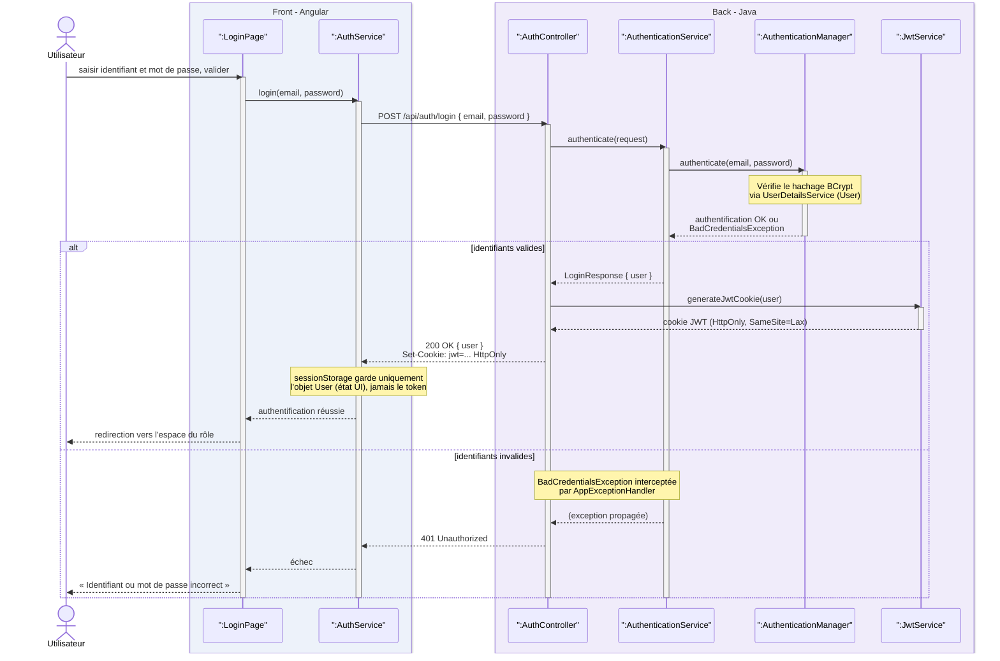

# Diagramme de séquence d'authentification

## Description

Ce diagramme détaille la règle RG12 (authentification par identifiant et mot de passe, puis échanges protégés par un token) et prépare RG13 (droits selon le rôle).

### Participants

La ligne de vie `Utilisateur` représente n'importe quel acteur cherchant à se connecter. Les objets suivants se répartissent entre les deux couches de l'application :

- `:LoginPage` (front Angular) : l'écran de connexion. Il collecte l'identifiant et le mot de passe, déclenche l'appel et affiche le résultat.
- `:AuthService` (front Angular) : le service qui émet la requête HTTP vers le back. Il ne manipule aucun token : il conserve uniquement l'objet `User` renvoyé, en `sessionStorage`, pour l'état de l'interface.
- `:AuthController` (back Java) : le point d'entrée REST, exposé sur `POST /api/auth/login`.
- `:AuthenticationService` (back Java) : orchestre la vérification des identifiants auprès de `AuthenticationManager`, puis retrouve l'utilisateur.
- `:AuthenticationManager` (back Java, Spring Security) : la vérification proprement dite, via `UserDetailsService` et le hachage BCrypt du mot de passe.
- `:JwtService` (back Java) : génère le jeton JWT et le prépare sous forme de cookie `HttpOnly`.

### Déroulé

L'utilisateur valide le formulaire ; `LoginPage` appelle `AuthService`, qui envoie la requête à `AuthController` ; celui-ci délègue à `AuthenticationService`, qui fait vérifier les identifiants par `AuthenticationManager`.

La suite dépend du résultat de cette vérification, d'où le fragment `alt` à deux branches :

- **identifiants valides** : `AuthenticationService` retourne l'utilisateur à `AuthController`, qui demande à `JwtService` de générer le jeton et de le poser dans un cookie `HttpOnly`, `SameSite=Lax`. La réponse `200 OK` contient l'objet `User` dans son corps et le cookie dans l'en-tête `Set-Cookie`. Côté front, `AuthService` ne garde que l'objet `User` en `sessionStorage`, pour l'affichage ; le jeton lui-même n'est jamais accessible en JavaScript. L'utilisateur est redirigé vers l'espace correspondant à son rôle.
- **identifiants invalides** : `AuthenticationManager` lève une `BadCredentialsException`, interceptée par `AppExceptionHandler`, qui répond `401 Unauthorized`. L'écran affiche « Identifiant ou mot de passe incorrect ».

Le cookie posé par le back est ensuite envoyé automatiquement par le navigateur à chaque requête vers l'API (le front passe `withCredentials: true`, sans manipuler d'en-tête `Authorization`) ; c'est lui qui permet le contrôle des droits par rôle (RG13), lu côté back par le filtre JWT à partir du cookie.
