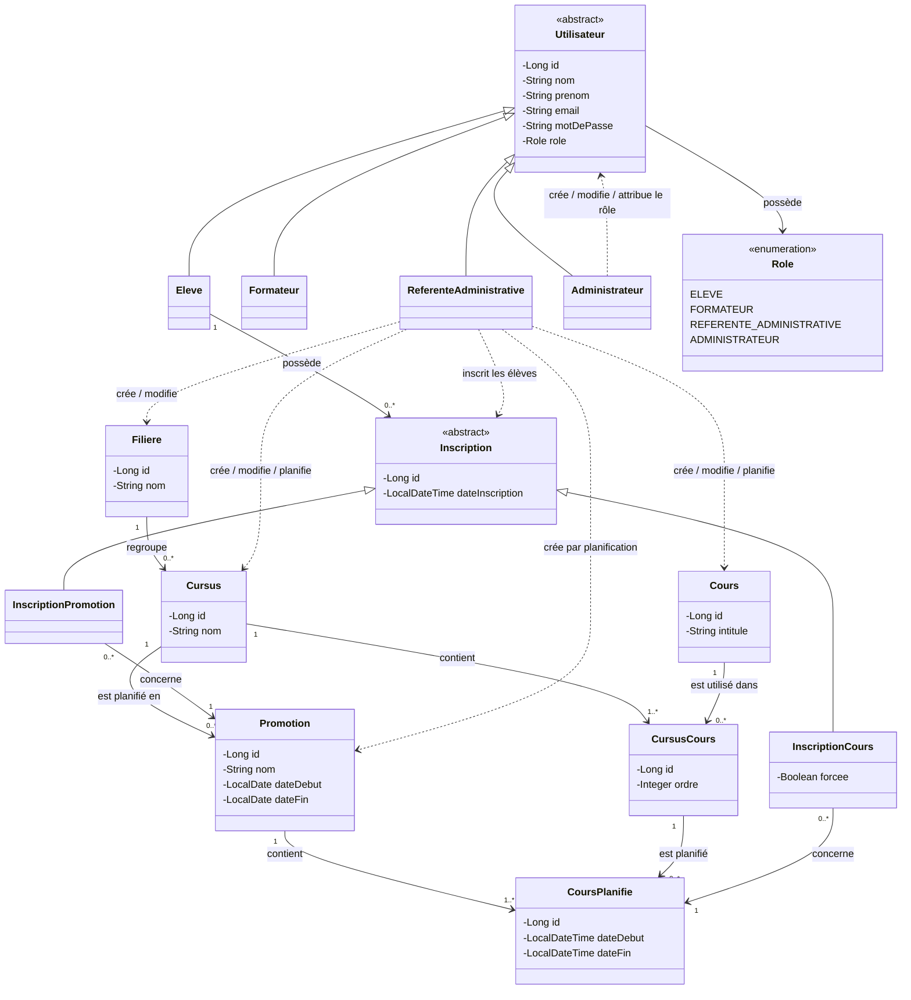

# Diagramme de classe metier

## 1. Précisions retenues pour la conception

Avant de construire les diagrammes, les responsabilités des acteurs sont précisées de la manière suivante.

### Administrateur

L'administrateur gère les **comptes utilisateurs** de l'application.

Il peut notamment :

- créer un compte utilisateur ;
- modifier un compte utilisateur ;
- attribuer un rôle à un utilisateur.

Aucun utilisateur ne crée lui-même son compte.

Lors de la création du compte, l'administrateur attribue l'un des rôles suivants :

- `ELEVE`
- `FORMATEUR`
- `REFERENTE_ADMINISTRATIVE`
- `ADMINISTRATEUR`

> Cette responsabilité de gestion des comptes n'était pas détaillée dans le cahier des charges initial. Elle constitue un choix de conception retenu pour définir le rôle de l'administrateur.

### Référente administrative

La référente administrative gère la partie **pédagogique** de l'application.

Elle peut :

- créer et modifier les filières ;
- créer et modifier les cursus ;
- créer et modifier les cours ;
- planifier un cursus afin de créer une promotion ;
- planifier les cours d'une promotion ;
- inscrire un élève à une promotion ;
- inscrire un élève à un cours spécifique ;
- forcer une inscription lorsque l'ordre pédagogique n'est pas respecté.

La référente administrative ne crée donc pas les comptes utilisateurs : elle travaille avec les élèves déjà créés dans l'application par l'administrateur.

### Élève

L'élève dispose uniquement d'un accès en consultation.

Il peut :

- accéder à son calendrier personnel ;
- visualiser les cours liés à sa promotion ;
- visualiser les cours auxquels il est inscrit à l'unité.

Il ne peut :

- créer son propre compte ;
- s'inscrire lui-même à une promotion ;
- s'inscrire lui-même à un cours ;
- modifier son calendrier ;
- modifier ou supprimer ses inscriptions.

Les inscriptions pédagogiques sont réalisées exclusivement par la référente administrative.

---

# 2. Diagramme de classes métier

## 2.1 Choix de modélisation

Le modèle repose sur les choix suivants :

- `Utilisateur` est une classe abstraite commune à tous les utilisateurs ;
- `Eleve`, `Formateur`, `ReferenteAdministrative` et `Administrateur` héritent de `Utilisateur` ;
- une énumération `Role` permet d'identifier les droits associés au compte ;
- l'administrateur gère les comptes utilisateurs et leur attribue un rôle ;
- la référente administrative gère les données pédagogiques et les inscriptions ;
- `CursusCours` représente la présence d'un cours dans un cursus à une position donnée ;
- `CoursPlanifie` représente la réalisation datée d'un cours dans une promotion ;
- `Inscription` est une classe abstraite spécialisée en inscription à une promotion et inscription à un cours ;
- le calendrier personnel n'est pas stocké comme une entité : il est construit à partir des inscriptions de l'élève.

## 2.2 Diagramme



---

## 2.3 Explication des principales classes

### `Utilisateur`

`Utilisateur` représente une personne disposant d'un compte dans l'application.

La classe est abstraite et regroupe les informations communes aux différents types d'utilisateurs.

Les classes spécialisées sont :

- `Eleve`
- `Formateur`
- `ReferenteAdministrative`
- `Administrateur`

Le rôle attribué au compte détermine les droits d'accès de l'utilisateur.

### `Role`

`Role` est une énumération contenant les différents rôles disponibles dans l'application :

```text
ELEVE
FORMATEUR
REFERENTE_ADMINISTRATIVE
ADMINISTRATEUR
```

L'administrateur attribue le rôle lors de la création ou de la modification d'un compte utilisateur.

Le type concret de l'utilisateur et son rôle doivent rester cohérents.

Exemple :

```text
Eleve -> Role.ELEVE
Formateur -> Role.FORMATEUR
```

### `Filiere`

Une filière regroupe plusieurs cursus.

Exemples :

- Développement ;
- Systèmes et Réseaux.

### `Cursus`

Un cursus représente un parcours de formation appartenant à une filière.

Il est composé de plusieurs cours organisés selon une progression pédagogique.

### `Cours`

Un cours représente un élément du catalogue pédagogique.

Exemples :

- Algorithmique ;
- Java ;
- SQL ;
- Spring Boot ;
- Angular.

### `CursusCours`

`CursusCours` représente l'association entre un cours et un cursus.

Il permet notamment de conserver la position du cours dans la progression pédagogique grâce à l'attribut `ordre`.

Cette classe intermédiaire est utile car un même intitulé de cours peut apparaître plusieurs fois dans un cursus.

Exemple :

| Cursus | Ordre | Cours |
|---|---:|---|
| DWWM | 1 | Algorithmique |
| DWWM | 2 | Initiation à la programmation |
| DWWM | 6 | Programmation Orientée Objet / Java |
| DWWM | 7 | Programmation Orientée Objet / Java |

### `Promotion`

Une promotion correspond à la planification d'un cursus sur une période donnée.

Un même cursus peut donc donner naissance à plusieurs promotions différentes.

### `CoursPlanifie`

`CoursPlanifie` représente l'occurrence réelle et datée d'un cours dans une promotion.

Il est associé :

- à une promotion ;
- à une occurrence de cours du cursus ;
- à une date de début ;
- à une date de fin.

### `Inscription`

`Inscription` est une classe abstraite représentant l'inscription pédagogique d'un élève.

Deux cas sont distingués.

#### `InscriptionPromotion`

Elle représente l'inscription d'un élève à une promotion complète.

L'élève accède alors aux cours planifiés appartenant à cette promotion.

#### `InscriptionCours`

Elle représente l'inscription d'un élève à un cours planifié à l'unité.

L'attribut :

```text
forcee : Boolean
```

permet d'indiquer si la référente administrative a forcé l'inscription malgré le non-respect de l'ordre pédagogique.

Le forçage ne permet pas de contourner la règle interdisant une double inscription au même cours.

---

# 3. Répartition des responsabilités

La gestion des comptes utilisateurs et la gestion des inscriptions pédagogiques sont deux responsabilités différentes.

```text
Administrateur
    |
    +-- crée les comptes utilisateurs
    +-- modifie les comptes utilisateurs
    +-- attribue les rôles


Référente administrative
    |
    +-- gère les filières
    +-- gère les cursus
    +-- gère les cours
    +-- crée les promotions par planification
    +-- planifie les cours
    +-- inscrit les élèves aux promotions
    +-- inscrit les élèves aux cours
    +-- peut forcer une inscription


Élève
    |
    +-- consulte son calendrier
    +-- consulte les cours de sa promotion
    +-- consulte les cours suivis à l'unité
    |
    +-- aucune création ou modification
```

Il n'existe donc pas de fonctionnalité d'auto-inscription ou d'auto-création de compte pour l'élève.

---

# 4. Construction du calendrier personnel

Le calendrier personnel n'est pas représenté comme une classe métier persistée.

Il correspond à une vue construite à partir des inscriptions de l'élève.

Deux sources doivent être regroupées :

```text
Élève
 |
 +-- InscriptionPromotion
 |       |
 |       +-- Promotion
 |              |
 |              +-- CoursPlanifies
 |
 +-- InscriptionCours
         |
         +-- CoursPlanifie
```

Le calendrier contient donc :

1. les cours planifiés appartenant à la promotion de l'élève ;
2. les cours planifiés auxquels l'élève a été inscrit à l'unité.

L'élève peut uniquement consulter ce résultat.

---


