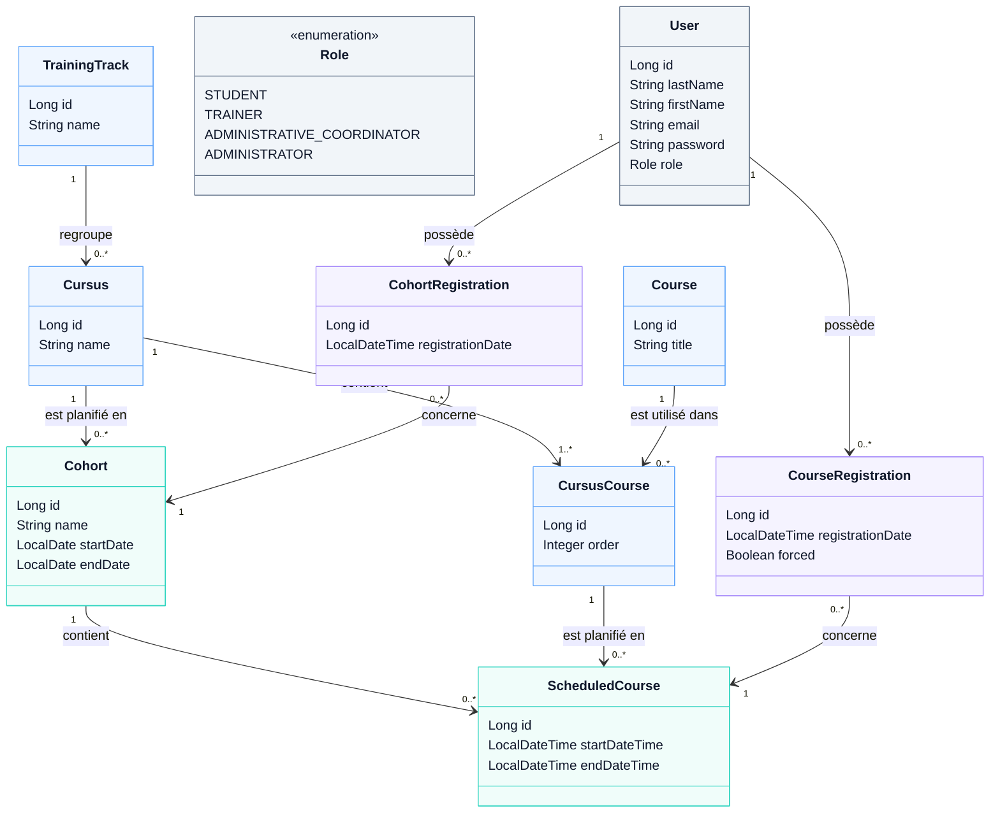

# Diagramme de classes métier

## Explication du diagramme

Le diagramme représente les principales entités métier de l'application de gestion pédagogique.

### Comptes utilisateurs

`User` représente un compte utilisateur de l'application.

Le type d'utilisateur est défini par `Role`, qui permet de distinguer :

- `STUDENT` : élève ;
- `TRAINER` : formateur ;
- `ADMINISTRATIVE_COORDINATOR` : référente administrative ;
- `ADMINISTRATOR` : administrateur.

---

### Structure pédagogique

`TrainingTrack` représente une filière.

Une filière regroupe plusieurs `Cursus`.

`Course` représente un cours du catalogue pédagogique.

`CursusCourse` permet d'associer un `Course` à un `Cursus` tout en conservant
sa position dans la progression pédagogique grâce à l'attribut `order`.

Cette classe permet notamment à un même cours d'être utilisé dans plusieurs
cursus ou à plusieurs positions différentes.

---

### Planification

Un `Cursus` peut être planifié dans le temps afin de créer une `Cohort`,
qui représente une promotion.

Les cours réellement programmés pour cette promotion sont représentés par
`ScheduledCourse`.

Un `ScheduledCourse` contient notamment une date et une heure de début ainsi
qu'une date et une heure de fin.

---

### Inscriptions pédagogiques

Un élève peut être inscrit de deux manières.

`CohortRegistration` représente l'inscription d'un élève à une promotion
complète.

`CourseRegistration` représente l'inscription d'un élève à un cours planifié
spécifique.

L'attribut `forced` permet d'indiquer qu'une inscription individuelle a été
autorisée malgré le non-respect de l'ordre pédagogique.

---

### Calendrier de l'élève

Le calendrier personnel de l'élève n'est pas stocké comme une entité.

Il est construit à partir de deux sources :

- les `ScheduledCourse` de la `Cohort` à laquelle l'élève est inscrit ;
- les `ScheduledCourse` auxquels l'élève est inscrit individuellement.

Le calendrier peut donc contenir des cours provenant de la promotion,
des cours individuels, ou les deux.