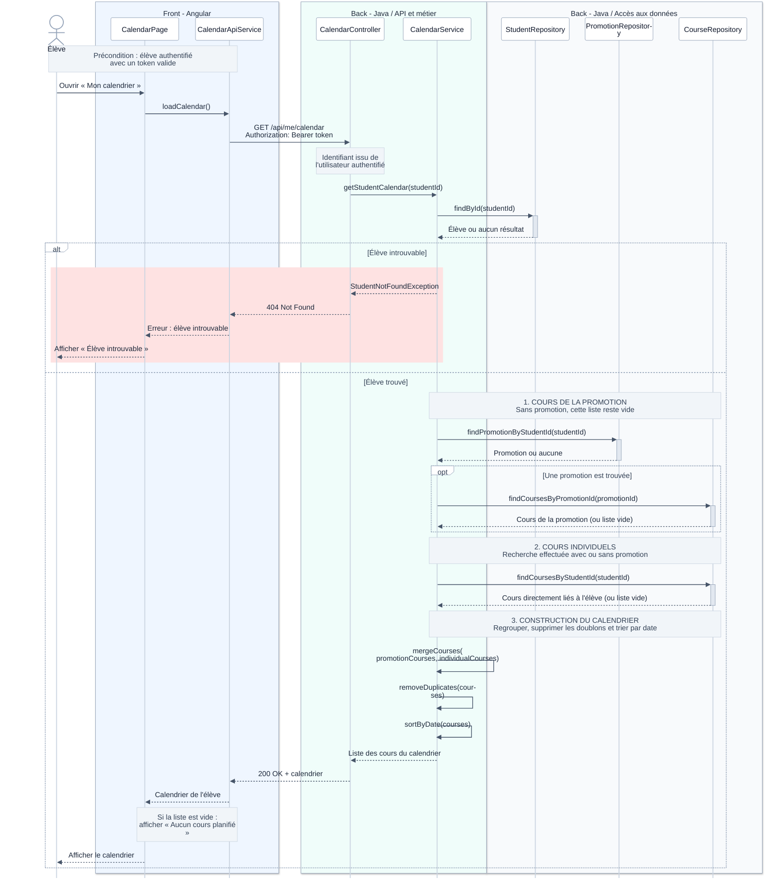

# Consultation du calendrier d'un élève

## Objectif

Permettre à l'élève de consulter son calendrier personnel, en lecture seule.
Aucune création, modification ou suppression de cours n'est proposée.

Le calendrier réunit les **cours de sa promotion** et les **cours auxquels il
est inscrit individuellement**. Il peut contenir l'une de ces sources, les deux,
ou aucun cours.

## Précondition

L'élève est déjà authentifié et possède un token valide. Le back-end
récupère son identifiant depuis l'utilisateur authentifié. L'authentification
est documentée dans un diagramme séparé.

## Diagramme de séquence

## Règles de fonctionnement

La recherche des cours individuels est effectuée **avec ou sans promotion**.
L'absence de promotion ou de cours n'est pas une erreur.

Les deux listes sont regroupées. Une même séance planifiée accessible par
les deux sources n'apparaît qu'une fois. Les cours sont ensuite triés par date
et heure de début.

| Situation | Résultat attendu |
| --- | --- |
| Des cours de promotion et des cours individuels | Afficher les deux sources, sans doublons. |
| Uniquement des cours de promotion | Afficher les cours de la promotion. |
| Uniquement des cours individuels | Afficher les cours individuels. |
| Aucun cours dans les deux sources | Renvoyer `200 OK` avec `[]` et afficher « Aucun cours planifié ». |
| Élève introuvable | Arrêter la consultation, renvoyer `404 Not Found` et afficher « Élève introuvable ». |

Seul le cas « Élève introuvable » est représenté comme une erreur dans
ce diagramme. Les autres erreurs techniques sont hors de son périmètre.