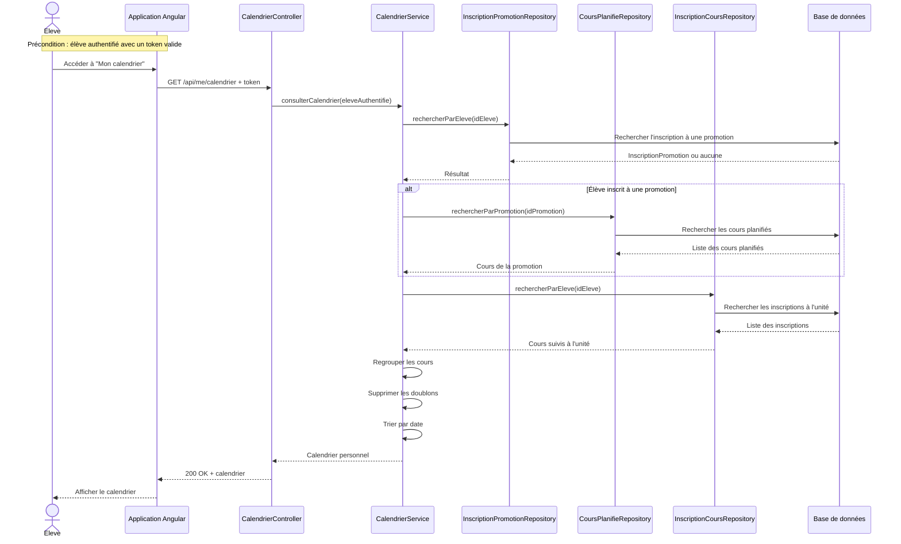

# Diagramme de séquence

## Consultation du calendrier d'un élève

### Précondition

L'élève est déjà authentifié et possède un token valide.

L'authentification n'est pas détaillée dans ce diagramme, car elle fait l'objet d'un diagramme de séquence séparé.

---

## Scénario nominal

1. L'élève ouvre la page **Mon calendrier**.
2. L'application Angular demande le calendrier de l'utilisateur authentifié.
3. Le back-end identifie l'élève à partir de son authentification.
4. Le service recherche si l'élève est inscrit à une promotion.
5. Si une promotion existe, les cours planifiés de cette promotion sont récupérés.
6. Le service recherche ensuite les cours auxquels l'élève est inscrit à l'unité.
7. Les deux listes de cours sont regroupées.
8. Les éventuels doublons sont supprimés.
9. Les cours sont triés par date.
10. Le calendrier est renvoyé à l'application Angular.
11. Angular affiche le calendrier à l'élève.

L'élève dispose uniquement d'un accès en consultation. Aucune opération de modification n'est proposée.

---

## Diagramme de séquence



---

## Remarque sur le calendrier

Le calendrier personnel n'est pas stocké comme une entité métier indépendante.

Il est construit à partir de deux sources :

```text
Élève
 |
 +-- InscriptionPromotion
 |       |
 |       +-- Promotion
 |              |
 |              +-- Cours planifiés
 |
 +-- InscriptionCours
         |
         +-- Cours planifié
```

Le calendrier regroupe donc :

- les cours liés à la promotion de l'élève ;
- les cours auxquels l'élève est inscrit à l'unité.

---

## Choix de l'URL

L'URL proposée est :

```http
GET /api/me/calendrier
```

Le terme `me` représente l'utilisateur actuellement authentifié.

Cette approche évite de transmettre directement l'identifiant de l'élève dans l'URL et permet au serveur de déterminer l'utilisateur à partir du token.

Elle est cohérente avec la règle métier selon laquelle un élève ne peut consulter que son propre calendrier.
