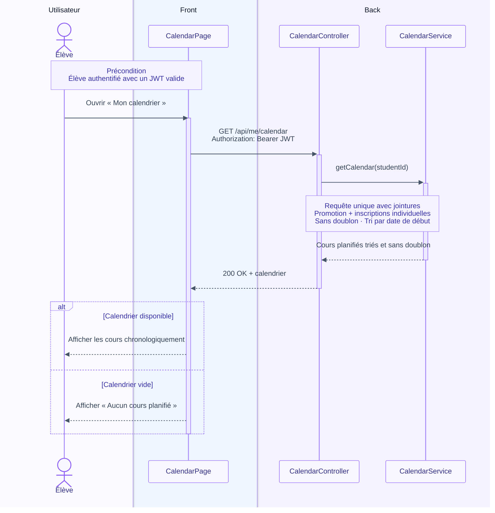

# Consultation du calendrier d'un élève

## Objectif

Permettre à un élève authentifié de consulter son calendrier personnel en
lecture seule. Le calendrier regroupe les cours de sa promotion et les cours
auxquels il est inscrit individuellement.

## Précondition

L'élève est authentifié et possède un token JWT valide. Le système retrouve son
identité à partir du contexte de sécurité, sans recevoir d'identifiant d'élève
dans l'URL.

## Diagramme de séquence

## Règles de fonctionnement

Le système exécute une seule requête de lecture. Ses jointures permettent de
récupérer simultanément :

- les cours planifiés de la promotion de l'élève ;
- les cours planifiés auxquels l'élève est inscrit individuellement.

Le résultat de cette requête est directement dédoublonné et trié par date et
heure de début. Le diagramme montre la responsabilité de chaque couche jusqu'au
service métier, sans détailler les repositories ni les traitements techniques
internes d'accès aux données.

Le token JWT est transmis dans l'en-tête HTTP `Authorization` avec le schéma
`Bearer`. Sa validité est contrôlée avant l'exécution du cas d'utilisation. Le
contrôleur utilise ensuite l'identité authentifiée issue du contexte de sécurité,
ce qui empêche l'élève de demander le calendrier d'un autre utilisateur en
modifiant un identifiant dans l'URL.

| Situation | Résultat attendu |
| --- | --- |
| Cours de promotion et cours individuels | Afficher les deux sources, sans doublon et par ordre chronologique. |
| Uniquement des cours de promotion | Afficher les cours de la promotion. |
| Uniquement des cours individuels | Afficher les cours individuels. |
| Aucun cours | Afficher « Aucun cours planifié ». |
