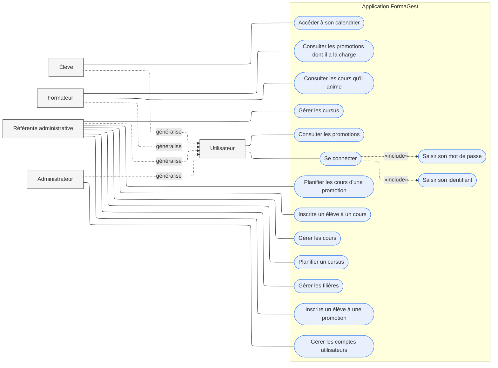

# Diagramme de cas d'utilisation global

### Acteurs et généralisation

Les quatre acteurs du cahier des charges (l'élève, la référente administrative, le formateur et l'administrateur) accèdent tous à l'application par un compte authentifié. Pour éviter de répéter les cas d'utilisation communs sur chacun, le diagramme introduit un acteur générique, `Utilisateur`, dont les quatre héritent par une relation. Ce qui est rattaché à `Utilisateur` est donc accessible aux quatre : se connecter et consulter les promotions.

### Cas d'utilisation par acteur

`Utilisateur` (donc tout le monde) : **Se connecter**, qui inclut *Saisir son identifiant* et *Saisir son mot de passe* (RG12), et **Consulter les promotions** (RG05).

L'**élève** : **Accéder à son calendrier**, en lecture seule (RG11, RG13). Le calendrier n'est pas stocké, il résulte de l'agrégation des inscriptions.

Le **formateur** consulte **les promotions dont il a la charge** et **les cours qu'il anime**, sans droit de modification. 

La **référente administrative** porte l'essentiel de la charge fonctionnelle, sur trois axes :

- structure pédagogique : **Gérer les filières**, **Gérer les cursus**, **Gérer les cours** (RG01, RG02) ;
- planification : **Planifier un cursus**, qui crée une promotion (RG03, RG04), et **Planifier les cours d'une promotion** ;
- inscriptions : **Inscrire un élève à une promotion** (RG06) et **Inscrire un élève à un cours** à l'unité (RG07).

L'**administrateur** se voit rattacher **Gérer les comptes utilisateurs**.