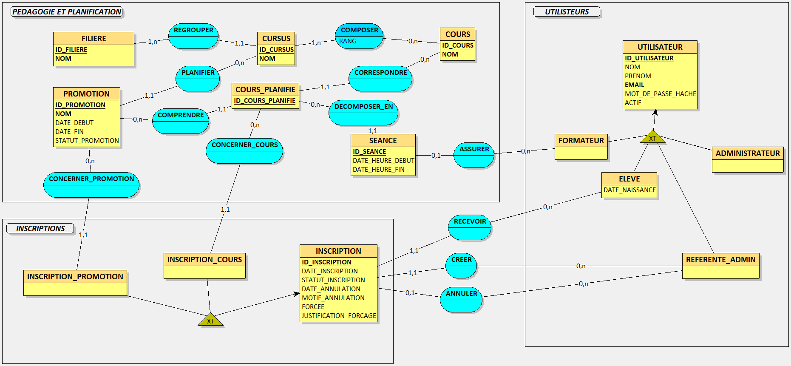
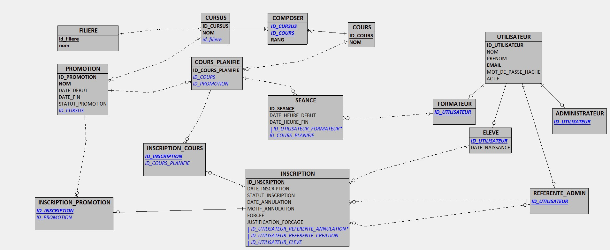
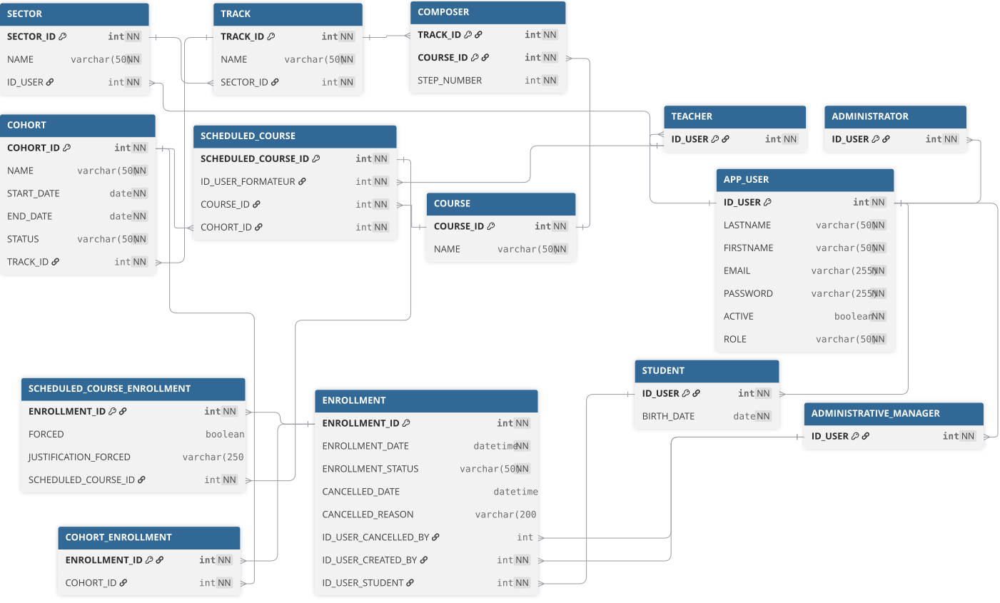

# Modélisation de la base de données

Cette page présente les trois niveaux de modélisation de la base de données de
FormaGest, du modèle métier jusqu'à son implémentation sous MySQL.

## 1. Modèle conceptuel de données (MCD)

Le MCD représente les données métier, leurs associations et leurs cardinalités,
indépendamment de toute technologie de base de données.

## 2. Modèle logique de données (MLD)

Le MLD traduit le modèle conceptuel sous forme relationnelle avec les tables,
les clés primaires et les clés étrangères.

## 3. Modèle physique de données (MPD)

Le MPD décrit l'implémentation du modèle relationnel pour le SGBD MySQL,
notamment les types de données et les contraintes physiques.

Le script SQL correspondant est disponible dans [MPD.sql](./MPD.sql).
