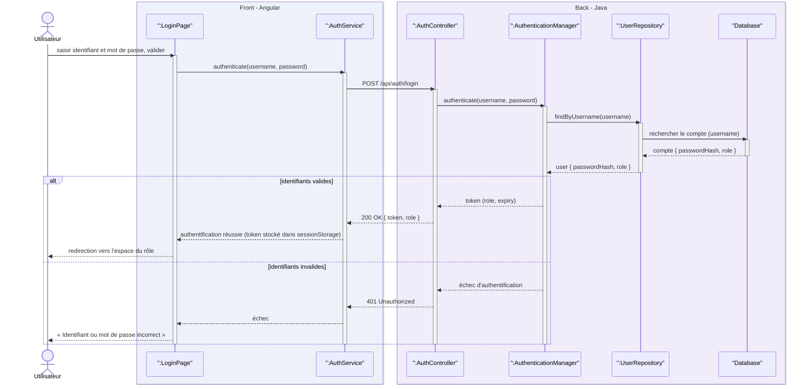

# Diagramme de séquence d'authentification

## Description

Ce diagramme détaille la règle RG12 (authentification par identifiant et mot de passe, puis échanges protégés par un token) et prépare RG13 (droits selon le rôle).

### Participants

La ligne de vie `Utilisateur` représente n'importe quel acteur cherchant à se connecter. Les objets suivants se répartissent entre les deux couches de l'application, la base de données venant en dernier côté back :

- `:LoginPage` (front Angular) : l'écran de connexion. Il collecte l'identifiant et le mot de passe, déclenche l'appel et affiche le résultat.
- `:AuthService` (front Angular) : le service qui émet la requête HTTP vers le back et conserve le token retourné côté client.
- `:AuthController` (back Java) : le point d'entrée REST, exposé sur `POST /api/auth/login`.
- `:AuthenticationManager` (back Java) : la vérification proprement dite. Il compare le mot de passe au hachage stocké, puis émet le token en cas de succès.
- `:UserRepository` (back Java) : l'accès aux comptes, via `findByUsername`.
- `Database` (back Java) : la base de données interrogée par le repository pour retrouver la ligne correspondant à l'identifiant.

### Déroulé

L'utilisateur valide le formulaire ; `LoginPage` appelle `AuthService`, qui envoie la requête à `AuthController` ; celui-ci délègue à `AuthenticationManager`, qui récupère le compte auprès de `UserRepository`. Le dépôt interroge à son tour la base de données, qui lui retourne la ligne du compte ; `UserRepository` renvoie alors l'utilisateur avec son hachage de mot de passe et son rôle.

La suite dépend du résultat de la vérification, d'où le fragment `alt` à deux branches :

- **identifiants valides** : `AuthenticationManager` produit un token (rôle, expiration), remonté jusqu'à `AuthService` dans une réponse `200 OK`. Le token est alors conservé côté client et l'utilisateur est redirigé vers l'espace correspondant à son rôle.
- **identifiants invalides** : aucune émission de token. Le back répond `401 Unauthorized` et l'écran affiche « Identifiant ou mot de passe incorrect ».

Le token conservé par `AuthService` est ensuite joint aux requêtes suivantes ; c'est lui qui permet le contrôle des droits par rôle (RG13).